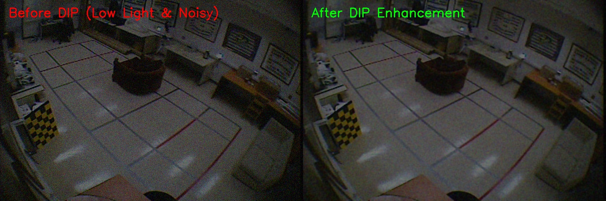

# PHẦN 3: PHƯƠNG PHÁP VÀ THIẾT KẾ HỆ THỐNG

## 3.1. Kiến trúc tổng quát của hệ thống

Hệ thống được thiết kế theo mô hình pipeline đa luồng (Multi-threaded Pipeline), gồm 6 giai đoạn xử lý nối tiếp, được phân chia thành 3 luồng độc lập để đảm bảo hiệu năng thời gian thực:

```
┌─────────────┐    ┌──────────────────┐    ┌──────────────────────────┐
│ Camera      │───→│ DIP              │───→│ YOLO-Pose + ByteTrack   │
│ Manager     │    │ Preprocessing    │    │ (Detect + Track + Pose) │
│ (Thread 1)  │    │ (Adaptive)       │    │                        │
└─────────────┘    └──────────────────┘    └──────────┬───────────────┘
                                                      │
                   ┌──────────────────┐    ┌──────────▼───────────────┐
                   │ Alerting Module  │←───│ Fall Classification     │
                   │ (Beep + UI +     │    │ (PoseBiGRU + Heuristic) │
                   │  Telegram + Log) │    │ (Thread 2 — Inference)  │
                   └──────────────────┘    └──────────────────────────┘
                                                      │
                   ┌──────────────────────────────────▼──────────────┐
                   │ GUI Application (Thread 3 — Main/UI Thread)    │
                   │ CustomTkinter (Login, Monitor, Settings,       │
                   │                History)                        │
                   └────────────────────────────────────────────────┘
```

**Luồng 1 — Camera Thread (`CameraManager`):** Đọc frame liên tục từ nguồn video (Webcam, file video, hoặc Camera IP qua HTTP/RTSP), áp dụng bộ lọc DIP thích nghi, chuyển đổi BGR→RGB, và đẩy vào buffer chia sẻ (shared latest frame).

**Luồng 2 — Inference Thread (`InferenceManager` + `FallDetectorWorker`):** Lấy frame mới nhất từ buffer, chạy qua YOLO-Pose → trích xuất skeleton → đẩy vào sliding window → PoseBiGRU inference → kết hợp heuristic → cập nhật trạng thái fall_state cho UI đọc.

**Luồng 3 — UI Thread (`MainApp`):** Hiển thị giao diện, đọc trạng thái từ Inference Thread mỗi 500ms, kích hoạt cảnh báo khi phát hiện ngã mới.

`[Placeholder: Chèn hình — Sơ đồ kiến trúc tổng quát hệ thống (System Architecture Diagram)]`

## 3.2. Module thu nhận và tiền xử lý video (DIP Preprocessing)

### 3.2.1. Thiết kế module CameraManager

Class `CameraManager` đóng vai trò lớp trừu tượng (Abstraction Layer) cho mọi nguồn video đầu vào. Nhờ thiết kế này, hệ thống có thể chuyển đổi linh hoạt giữa:
- **Webcam:** Tham số `source=0` (mặc định)
- **File video:** Tham số `source="path/to/video.mp4"` — tự động loop khi hết video
- **Camera IP:** Tham số `source="http://192.168.1.x:8080/video"` — hỗ trợ HTTP stream và RTSP

CameraManager chạy trên luồng riêng, đọc frame theo tốc độ FPS gốc của nguồn video, áp dụng pipeline DIP trên từng frame rồi lưu vào biến chia sẻ (`latest_frame`) được bảo vệ bằng `threading.Lock`.

### 3.2.2. Pipeline tiền xử lý thích nghi (Adaptive Enhancement)

Thay vì áp dụng bộ lọc cố định, hệ thống triển khai một pipeline tự hiệu chuẩn (Auto-Calibration) gồm các bước:

1. **Giai đoạn hiệu chuẩn (Calibration Phase):** Khi camera bắt đầu hoạt động, hệ thống thu thập 30 frame đầu tiên để tính toán các chỉ số baseline:
   - **Baseline Brightness:** Độ sáng trung bình của ảnh
   - **Baseline Noise:** Mức nhiễu ước tính (dựa trên độ lệch chuẩn của ảnh Laplacian)
   - **Baseline Contrast:** Độ tương phản trung bình

2. **Giai đoạn xử lý thích nghi (Adaptive Processing):** Dựa trên so sánh giữa frame hiện tại và baseline:
   - **Khử nhiễu (Denoising):** Áp dụng `cv2.fastNlMeansDenoisingColored()` khi noise level vượt ngưỡng, với cường độ lọc tỷ lệ thuận với mức nhiễu. Gaussian Blur ($3 \times 3$) được áp dụng bổ sung nếu nhiễu nặng.
   - **Cân bằng sáng (CLAHE):** Áp dụng trên kênh L của không gian màu LAB khi độ sáng frame thấp hơn 70% baseline. Tham số `clipLimit` và `tileGridSize` được điều chỉnh tự động theo mức chênh lệch.
   - **Xử lý ngược sáng (Backlight Compensation):** Phát hiện tình huống ngược sáng dựa trên histogram bi-modal, sau đó áp dụng tone mapping cục bộ để khôi phục chi tiết vùng tối.
   - **Cân bằng trắng (White Balance):** Hiệu chỉnh màu sắc bằng thuật toán Grey World khi phát hiện dịch chuyển màu (color cast).



## 3.3. Module nhận dạng và theo dõi đối tượng

### 3.3.1. YOLO-Pose Inference

Class `FallDetectorWorker` tích hợp mô hình `yolo11s-pose.pt` với cấu hình inference được tối ưu:

| Tham số | Giá trị | Lý do |
|---------|---------|-------|
| `conf` | 0.10 | Ngưỡng rất thấp để không bỏ sót người ở tư thế nằm (box nhỏ, mờ) |
| `iou` | 0.45 | Ngưỡng NMS chuẩn cho single-class detection |
| `imgsz` | 960 | Độ phân giải cao hơn mặc định (640) để tăng độ chính xác keypoints |
| `classes` | [0] | Chỉ phát hiện class "person" |
| `tracker` | bytetrack.yaml | ByteTrack — không dùng GMC optical flow, tránh crash khi frame size thay đổi |

### 3.3.2. Bộ lọc 3 tầng xác minh người thật (_is_valid_person)

Do YOLO với `conf=0.10` sẽ phát hiện được nhiều box — bao gồm cả ghế, vật dụng bị nhầm lẫn — hệ thống triển khai bộ lọc 3 tầng:

- **Tầng 1 — YOLO Box Confidence:** Loại bỏ các detection có confidence < 0.25
- **Tầng 2 — Số keypoints nhìn thấy:** Yêu cầu tối thiểu 3 keypoints có confidence > 0.3 (ngưỡng thấp để không loại người nằm bị che)
- **Tầng 3 — Core Body Parts:** Yêu cầu ít nhất 1 vai HOẶC 1 hông phải nhìn thấy — đây là các điểm mốc cốt lõi xác định đó là người thật, không phải đồ vật

## 3.4. Module phân loại hành vi té ngã

Hệ thống sử dụng kiến trúc **Two-tier Detection** — kết hợp mô hình học sâu PoseBiGRU và hệ thống quy tắc heuristic.

### 3.4.1. Tầng 1 — Mạng PoseBiGRU-Attention (Model-based)

Mỗi khi thu thập đủ chuỗi 30 frame tư thế cho một Track ID, chuỗi được đóng gói thành tensor $(1, 30, 17, 3)$ và đưa qua mô hình PoseBiGRU. Đầu ra Softmax cho xác suất 2 lớp: $P(\text{Fall})$ và $P(\text{Non-Fall})$.

- Nếu $P(\text{Fall}) \geq$ `conf_threshold` (mặc định 0.50, có thể chỉnh trên UI): hệ thống kích hoạt cảnh báo.
- Nếu $P(\text{Fall}) \geq$ `rule_model_soft_threshold` (0.25): trạng thái "khả nghi" được đánh dấu, cung cấp thêm điểm cho cơ chế voting ở Tầng 2.

### 3.4.2. Tầng 2 — Hệ thống quy tắc Heuristic (Rule-based Voting)

Song song với mô hình AI, hệ thống tính toán **8 chỉ số hình học và động học** từ dữ liệu YOLO-Pose tại mỗi frame:

| Chỉ số | Mô tả | Điểm |
|--------|-------|------|
| `lying_by_box` | Tỷ lệ chiều rộng/chiều cao bounding box ≥ 1.35 | +2 |
| `torso_horizontal` | Góc giữa vai và hông so với phương ngang ≤ 35° | +1 |
| `head_below_hip` | Đầu nằm thấp hơn hông (trục Y hướng xuống) | +2 |
| `collapsed` | Chiều cao box hiện tại < 55% chiều cao cực đại đã ghi nhận | +1 |
| `height_ratio_drop` | Chiều cao box giảm xuống dưới 50% so với max | +1 |
| `sudden_motion` | Tốc độ di chuyển trọng tâm ≥ 70% chiều cao frame/giây | +2 |
| `lower_body_area` | Đối tượng nằm ở nửa dưới khung hình | +1 |
| `model_suspicious` | PoseBiGRU cho $P(\text{Fall}) \geq 0.25$ | +2 |

**Cơ chế biểu quyết (Voting):** Tổng điểm ≥ 4.5 → trạng thái "khả nghi" (`suspicious`). Khi "khả nghi" liên tục ≥ 2 frame VÀ thỏa thêm một trong ba điều kiện: (1) có dáng nằm rõ ràng, (2) sập đổ đột ngột, hoặc (3) Model AI tin cậy cao — hệ thống kích hoạt cảnh báo.

### 3.4.3. Các biện pháp chống cảnh báo giả (False Positive Mitigation)

Trong quá trình phát triển, nhóm đã xử lý các trường hợp thực tế gây cảnh báo giả:

- **Cúi nhặt đồ / Quỳ gối:** Tăng ngưỡng `lying_by_box` từ 1.1 → 1.35; chỉ cho `torso_horizontal` 1 điểm (thay vì 2); thêm chỉ số `head_below_hip` (+2 điểm) vì khi cúi nhặt đồ, đầu hiếm khi thấp hơn hông rõ rệt.
- **Ngồi gần camera:** Khi không phát hiện được phần dưới cơ thể (`lower_body_kpts == 0`) và box bị cắt ở mép dưới frame → tắt `lying_by_box`.
- **Người đang đứng thẳng:** Khi góc thân ≥ 60° (torso_vertical) → bắt buộc `lying_by_box = False`.
- **Người biến mất khỏi camera:** Module `_check_lost_tracks` — khi một người đang ở trạng thái khả nghi hoặc đang đứng thẳng đột ngột mất track trong 0.2–2.0 giây → đánh dấu `LOST_AFTER_SUSPECTED_FALL`.

### 3.4.4. Cơ chế Debounce/Cooldown chống Spam Alert

Để tránh gửi cảnh báo lặp lại cho cùng một sự kiện ngã, hệ thống áp dụng cơ chế Cooldown thông minh trong `InferenceManager`:

1. **Lần đầu phát hiện ngã:** Gửi DUY NHẤT 1 cảnh báo, lưu Track ID vào bảng cooldown.
2. **Trong khi nạn nhân còn nằm:** Liên tục cập nhật timestamp trong bảng cooldown — KHÔNG gửi thêm cảnh báo mới.
3. **Khi đứng lên:** Track ID chuyển sang trạng thái `is_fall = False`. Chỉ khi duy trì trạng thái an toàn > `cooldown_time` (mặc định 3 giây) thì Track ID mới được xóa khỏi bảng cooldown — cho phép phát hiện lần ngã tiếp theo.

## 3.5. Module ghi log và lưu ảnh bằng chứng (Snapshot)

Class `FallLogger` hoạt động trên luồng nền riêng biệt, sử dụng hàng đợi (`queue.Queue`) để tránh block UI:

1. Khi có sự kiện ngã mới, `log_fall()` được gọi kèm theo frame hiện tại (ảnh annotated từ YOLO).
2. Frame được chuyển từ RGB → BGR và lưu thành file JPEG tại `logs/snapshots/fall_cam_YYYYMMDD_HHMMSS_idXX.jpg`.
3. Dòng dữ liệu `[Timestamp, Camera_Source, Track_ID, Status, Snapshot_Path]` được đẩy vào queue.
4. Worker thread lấy dữ liệu từ queue và ghi vào file `fall_history.csv` theo mode append.

## 3.6. Module cảnh báo qua Telegram

Class `TelegramNotifier` cho phép gửi cảnh báo đến điện thoại người giám hộ qua Telegram Bot API:

- **Cấu hình:** Bot Token và Chat ID được lưu trong file `telegram_config.json`, có thể bật/tắt và chỉnh sửa trực tiếp từ giao diện Cài đặt.
- **Khi phát hiện ngã:** Hệ thống gửi HTTP POST đến Telegram API kèm theo: tin nhắn cảnh báo (chứa tên camera, thời gian, ID nạn nhân) và ảnh Snapshot chụp tại khoảnh khắc ngã.
- **Non-blocking:** Việc gửi tin nhắn chạy trên thread daemon riêng, đảm bảo không ảnh hưởng đến tốc độ inference hay UI.

`[Placeholder: Chèn hình — Ảnh chụp tin nhắn cảnh báo Telegram trên điện thoại]`
