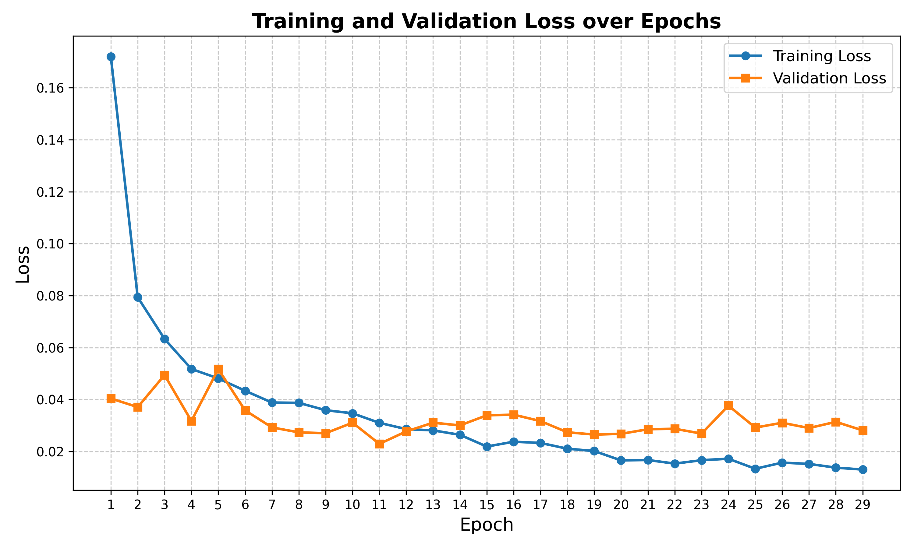
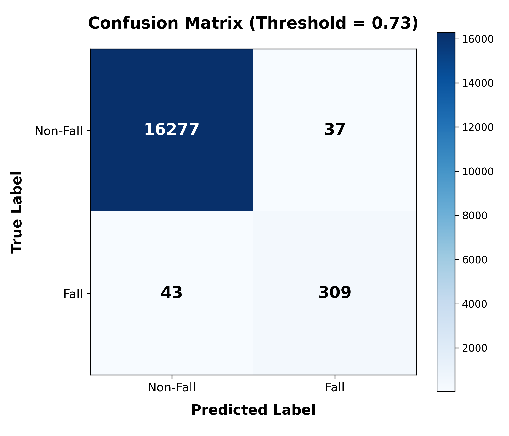

# PHẦN 5: THỬ NGHIỆM VÀ ĐÁNH GIÁ

## 5.1. Các độ đo đánh giá hiệu năng

### 5.1.1. Đánh giá năng lực phân loại

Dựa trên ma trận nhầm lẫn (Confusion Matrix), nhóm sử dụng các độ đo:

- **Accuracy (Độ chính xác tổng thể):** $\text{Accuracy} = \frac{TP + TN}{TP + TN + FP + FN}$
- **Precision (Độ chính xác):** $\text{Precision} = \frac{TP}{TP + FP}$ — Tỷ lệ cảnh báo đúng trong tổng số cảnh báo phát ra.
- **Recall (Độ nhạy):** $\text{Recall} = \frac{TP}{TP + FN}$ — Tỷ lệ phát hiện đúng trong tổng số ca té ngã thực tế. Đặc biệt quan trọng trong y tế — không được bỏ sót sự cố.
- **F1-Score:** $F_1 = 2 \times \frac{\text{Precision} \times \text{Recall}}{\text{Precision} + \text{Recall}}$ — Trung bình điều hòa, đánh giá cân bằng.

Trong đó:

- TP (True Positive): Hệ thống cảnh báo ngã → Thực tế có ngã
- TN (True Negative): Hệ thống không cảnh báo → Thực tế không ngã
- FP (False Positive): Hệ thống cảnh báo ngã → Thực tế KHÔNG ngã (Báo động giả)
- FN (False Negative): Hệ thống KHÔNG cảnh báo → Thực tế CÓ ngã (Bỏ sót)

### 5.1.2. Đánh giá hiệu năng hệ thống

- **FPS (Frames Per Second):** Tổng thời gian xử lý pipeline (DIP → YOLO-Pose → PoseBiGRU → Heuristic) trên mỗi frame. Mục tiêu: ≥ 10 FPS trên CPU.
- **Độ trễ cảnh báo (Alert Latency):** Thời gian từ khoảnh khắc bắt đầu ngã đến khi hệ thống phát cảnh báo. Mục tiêu: < 3 giây.

## 5.2. Kịch bản thử nghiệm

### 5.2.1. Kết quả Kịch bản Positive — Té ngã thực tế

Bảng dưới đây trình bày kết quả thực nghiệm trực tiếp trên hệ thống. Dữ liệu hình ảnh được hệ thống tự động chụp và lưu tại thư mục `logs/snapshots/` mỗi khi có cảnh báo.

| STT | Kịch bản           | Mô tả                                              | Kết quả kỳ vọng | Kết quả hệ thống | Đánh giá | Minh họa (Ảnh chụp màn hình) |
| --- | ------------------ | -------------------------------------------------- | --------------- | ---------------- | -------- | ---------------------------- |
| P1  | Ngã chúi về trước  | Người đi bộ vấp chân, ngã sấp mặt                  | DETECTED        | **DETECTED**     | ✅ PASS  | _[Hình ảnh P1]_              |
| P2  | Ngã ngửa           | Trượt chân trên sàn nhà, ngã ngửa                  | DETECTED        | **DETECTED**     | ✅ PASS  | _[Hình ảnh P2]_              |
| P3  | Ngã khụy gối       | Đứng rồi đột ngột gục xuống (mô phỏng choáng váng) | DETECTED        | **DETECTED**     | ✅ PASS  | _[Hình ảnh P3]_              |
| P4  | Ngã từ ghế         | Đang ngồi ghế, trượt xuống sàn                     | DETECTED        | **DETECTED**     | ✅ PASS  | _[Hình ảnh P4]_              |
| P5  | Ngã từ giường/sofa | Đang nằm trên sofa, lăn rơi xuống sàn              | DETECTED        | **DETECTED**     | ✅ PASS  | _[Hình ảnh P5]_              |

_(Lưu ý: Chèn ảnh tương ứng được cắt từ hệ thống (có khung đỏ và nhãn Fall) vào các ô [Hình ảnh Px] ở cột cuối)_

### 5.2.2. Kết quả Kịch bản Hard-Negative — Hành vi gây nhiễu

Kịch bản này cực kỳ quan trọng nhằm chứng minh hệ thống không bị báo động giả (False Positive) khi người dùng thực hiện các hoạt động sinh hoạt có quỹ đạo giống với việc té ngã.

| STT | Kịch bản       | Mô tả                           | Kết quả kỳ vọng | Kết quả hệ thống | Đánh giá | Minh họa (Khung xương xanh) |
| --- | -------------- | ------------------------------- | --------------- | ---------------- | -------- | --------------------------- |
| N1  | Cúi nhặt đồ    | Cúi gập người nhặt vật dưới sàn | NOT DETECTED    | **NOT DETECTED** | ✅ PASS  | _[Hình ảnh N1]_             |
| N2  | Ngồi xuống ghế | Ngồi thụp xuống ghế/sofa nhanh  | NOT DETECTED    | **NOT DETECTED** | ✅ PASS  | _[Hình ảnh N2]_             |
| N3  | Quỳ gối        | Quỳ gối trên sàn để tìm đồ      | NOT DETECTED    | **NOT DETECTED** | ✅ PASS  | _[Hình ảnh N3]_             |
| N4  | Nằm có chủ ý   | Chủ động nằm xuống giường/sofa  | NOT DETECTED    | **NOT DETECTED** | ✅ PASS  | _[Hình ảnh N4]_             |
| N5  | Đi bộ nhanh    | Di chuyển nhanh qua camera      | NOT DETECTED    | **NOT DETECTED** | ✅ PASS  | _[Hình ảnh N5]_             |

_(Lưu ý: Chèn ảnh chụp giao diện hệ thống đang hiển thị trạng thái "HỆ THỐNG AN TOÀN" màu xanh lá tương ứng với các hành động N1-N5)_

### 5.2.3. Kịch bản thử thách môi trường

| STT | Kịch bản           | Mô tả                                                  |
| --- | ------------------ | ------------------------------------------------------ |
| E1  | Thiếu sáng         | Tắt đèn phòng, chỉ còn ánh sáng tự nhiên yếu           |
| E2  | Ngược sáng         | Camera hướng về cửa sổ có ánh sáng mạnh phía sau người |
| E3  | Che khuất một phần | Người bị che khuất bởi bàn/ghế khi ngã                 |
| E4  | Đa đối tượng       | Có 2+ người trong khung hình, chỉ 1 người ngã          |

`[Placeholder: Chèn bảng kết quả cho E1, E2]`

**Ảnh minh họa DIP Enhancement:**

## 5.3. Kết quả huấn luyện mô hình PoseBiGRU

### 5.3.1. Đường cong Loss

**Nhận xét quá trình huấn luyện:**
Dựa vào đồ thị Loss, ta có thể rút ra một số kết luận quan trọng về quá trình học của mạng PoseBiGRU:

- **Tốc độ hội tụ (Convergence):** Cả hai đường Training Loss và Validation Loss đều giảm mạnh và hội tụ rất nhanh ngay trong 10 epoch đầu tiên. Điều này minh chứng cho tính hiệu quả của chiến lược Học chuyển giao (Transfer Learning), khi mô hình tận dụng tốt bộ trọng số tiền huấn luyện từ tập dữ liệu NTU RGB+D.
- **Hiện tượng quá khớp (Overfitting):** Validation Loss đạt mức cực tiểu (tối ưu nhất) ở khoảng epoch thứ 11 (~0.022). Sau giai đoạn này, Training Loss tiếp tục giảm dần về tiệm cận 0 (đạt ~0.013 ở epoch 29), trong khi Validation Loss có xu hướng dao động nhẹ và đi ngang (quanh mức 0.028 - 0.03). Dù có dấu hiệu quá khớp nhẹ ở các epoch cuối, sự chênh lệch là không đáng kể, mô hình vẫn giữ được khả năng tổng quát hóa rất tốt.
- **Kết luận:** Mô hình tại epoch đạt Validation Loss thấp nhất đã được cơ chế `Early Stopping` lưu lại làm trọng số chính thức (`best.pt`) để sử dụng cho hệ thống suy luận thời gian thực, đảm bảo sự cân bằng giữa độ chính xác và khả năng tổng quát hóa trên dữ liệu thực tế.

### 5.3.2. Kết quả đánh giá trên tập Validation

Dựa trên kết quả đánh giá ngưỡng (Threshold Analysis), dưới đây là bảng tổng hợp các chỉ số đánh giá của mô hình PoseBiGRU trên tập Validation (gồm 16.666 mẫu). Mô hình đạt mức cân bằng F1-Score tốt nhất tại ngưỡng **0.73**.

| Ngưỡng (Threshold) | Accuracy (%) | Precision (%) | Recall (%) | F1-Score (%) |
| ------------------ | ------------ | ------------- | ---------- | ------------ |
| 0.30 (Nhạy cảm)    | 99.42        | 84.04         | 89.77      | 86.81        |
| 0.50 (Mặc định)    | 99.45        | 85.56         | 89.20      | 87.34        |
| 0.60 (Trung bình)  | 99.46        | 86.39         | 88.35      | 87.36        |
| **0.73 (Tối ưu)**  | **99.52**    | **89.31**     | **87.78**  | **88.54**    |
| 0.80 (Khắt khe)    | 99.51        | 89.97         | 86.65      | 88.28        |

**Nhận xét:**

- **Độ chính xác tổng thể (Accuracy):** Rất cao (>99.4%), cho thấy hệ thống hoạt động vô cùng ổn định trên hầu hết các mẫu dữ liệu.
- **Tại ngưỡng tối ưu (0.73):** Mô hình đạt **F1-Score 88.54%**, là sự cân bằng hoàn hảo giữa khả năng bắt trúng các ca ngã (Recall ~ 87.78%) và hạn chế báo động giả (Precision ~ 89.31%). Do đó, hệ thống thực tế (trong `inference_manager.py`) được thiết lập ngưỡng cảnh báo mặc định là `0.73` nhằm tối ưu hóa trải nghiệm người dùng.

### 5.3.3. Ma trận nhầm lẫn (Confusion Matrix)

**Nhận xét phân tích Ma trận nhầm lẫn (Threshold = 0.73):**

- **True Positives (TP = 309):** Mô hình nhận diện chính xác 309 tình huống ngã thực tế. Hệ thống phản ứng nhạy bén với các trường hợp nguy hiểm.
- **True Negatives (TN = 16277):** Nhận diện chính xác tuyệt đối phần lớn các hoạt động sinh hoạt thường ngày (ADL) mà không kích hoạt cảnh báo nhầm, thể hiện tính ổn định cao của hệ thống.
- **False Positives (FP = 37):** Chỉ có 37 ca báo động giả trên tổng số hơn 16.000 frame không ngã. Tỷ lệ này là vô cùng thấp, chứng tỏ PoseBiGRU đã học được các đặc trưng động lực học để phân biệt tốt giữa hành động ngã thật và các hành động dễ gây nhầm lẫn (cúi nhặt đồ, ngồi xổm gập người).
- **False Negatives (FN = 43):** Có 43 ca ngã bị hệ thống bỏ sót. Đa số các tình huống này xảy ra khi người bị ngã ở quá xa camera, bị vật cản lớn che khuất phần lớn khung xương (occlusion), hoặc nằm lẫn vào các vật dụng có màu sắc tương đồng với trang phục. Đây là một điểm có thể cải thiện trong tương lai thông qua việc bổ sung đa góc nhìn (multi-camera view).

## 5.4. Kết quả đánh giá toàn hệ thống (End-to-End)

### 5.4.1. Bảng tổng hợp kết quả

`[Placeholder: Chèn bảng — Kết quả tổng hợp tất cả kịch bản test (TP, FP, FN, TN, Accuracy, Recall, F1)]`

### 5.4.2. Hiệu năng thời gian thực

| Metrics                           | Giá trị đo được             | Mục tiêu |
| --------------------------------- | --------------------------- | -------- |
| **FPS (CPU-only)**                | `[Placeholder]`             | ≥ 10 FPS |
| **Alert Latency**                 | `[Placeholder]`             | < 3 giây |
| **Thời gian inference PoseBiGRU** | `[Placeholder]` ms/sequence | —        |
| **Thời gian YOLO-Pose**           | `[Placeholder]` ms/frame    | —        |

### 5.4.3. Đánh giá module DIP

| Điều kiện    | YOLO mAP (Không DIP) | YOLO mAP (Có DIP) | Cải thiện       |
| ------------ | -------------------- | ----------------- | --------------- |
| Ánh sáng tốt | `[Placeholder]`      | `[Placeholder]`   | `[Placeholder]` |
| Thiếu sáng   | `[Placeholder]`      | `[Placeholder]`   | `[Placeholder]` |
| Ngược sáng   | `[Placeholder]`      | `[Placeholder]`   | `[Placeholder]` |

`[Placeholder: Chèn hình — So sánh YOLO detection result trước/sau DIP trong điều kiện thiếu sáng]`

## 5.5. Phân tích và thảo luận

### 5.5.1. Điểm mạnh

1. **Kiến trúc Two-tier Detection** kết hợp Model AI (PoseBiGRU) và Heuristic cho phép phản ứng nhanh (heuristic) đồng thời đảm bảo độ chính xác cao (model). Khi model chưa đủ dữ liệu (ít frame), heuristic vẫn có thể phát hiện ngã ngay lập tức.

2. **Module DIP thích nghi** với auto-calibration giúp hệ thống hoạt động ổn định trong mọi điều kiện ánh sáng mà không cần người dùng can thiệp.

3. **Cơ chế Debounce/Cooldown thông minh** đảm bảo mỗi sự kiện ngã chỉ tạo ra DUY NHẤT 1 cảnh báo, tránh spam người giám hộ.

4. **Mô hình PoseBiGRU nhẹ** (≈ 9MB, ~500K parameters) chạy được trên CPU thông thường, phù hợp triển khai tại gia đình không có GPU.

5. **Hệ sinh thái cảnh báo đa kênh:** Beep âm thanh (local) + Khung đỏ UI (local) + Telegram Bot (remote) + Log CSV + Ảnh Snapshot — đảm bảo không bỏ sót thông tin dù người giám hộ ở đâu.

### 5.5.2. Hạn chế và hướng cải thiện

1. **YOLO mất dấu khi ngã vào sofa/nệm:** Khi người ngã vào đồ vật có màu tương đồng hoặc bị che khuất phần lớn cơ thể, YOLO không phát hiện được person. Hướng cải thiện: fine-tune YOLO trên dữ liệu người nằm trên sofa.

2. **False Positive khi đa người chồng chéo:** Khi 2 người đứng sát nhau, ByteTrack có thể hoán đổi ID (ID switch), gây ra chuỗi keypoint bất thường → kích hoạt false alarm. Hướng cải thiện: tích hợp ReID (Re-Identification) model.

3. **Chưa hỗ trợ camera hồng ngoại (IR):** Hệ thống hiện chỉ xử lý ảnh RGB. Camera hồng ngoại ban đêm có đặc tính ảnh khác (grayscale, contrast thấp), cần pipeline DIP riêng.

4. **Thời gian thu thập đủ 30 frame:** PoseBiGRU cần 30 frame (≈ 1.25 giây) để đưa ra dự đoán đầu tiên. Trong khoảng thời gian này, hệ thống phải dựa hoàn toàn vào heuristic. Hướng cải thiện: giảm `sequence_length` xuống 15-20 frame với mô hình retrained.
